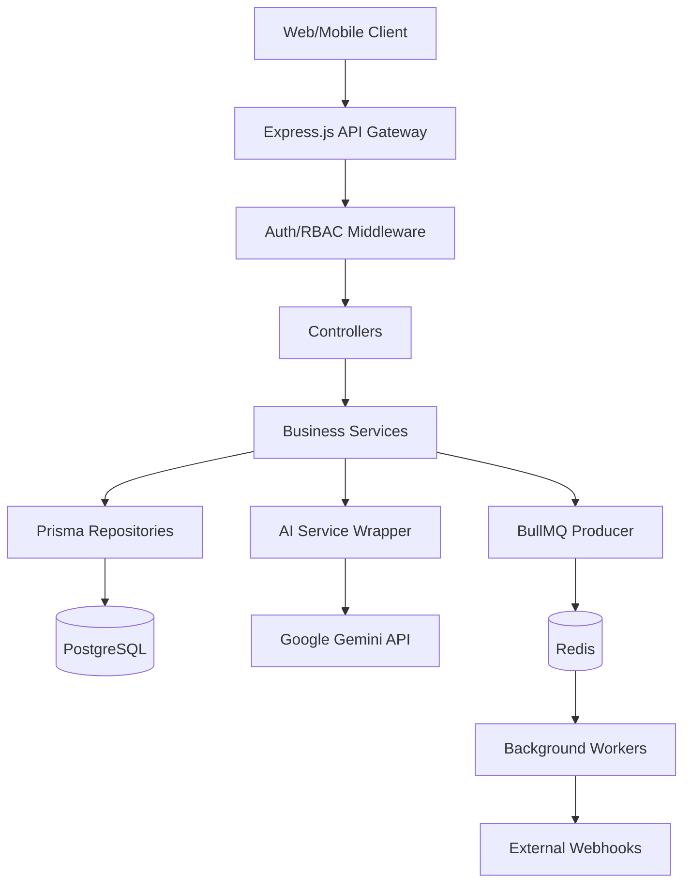
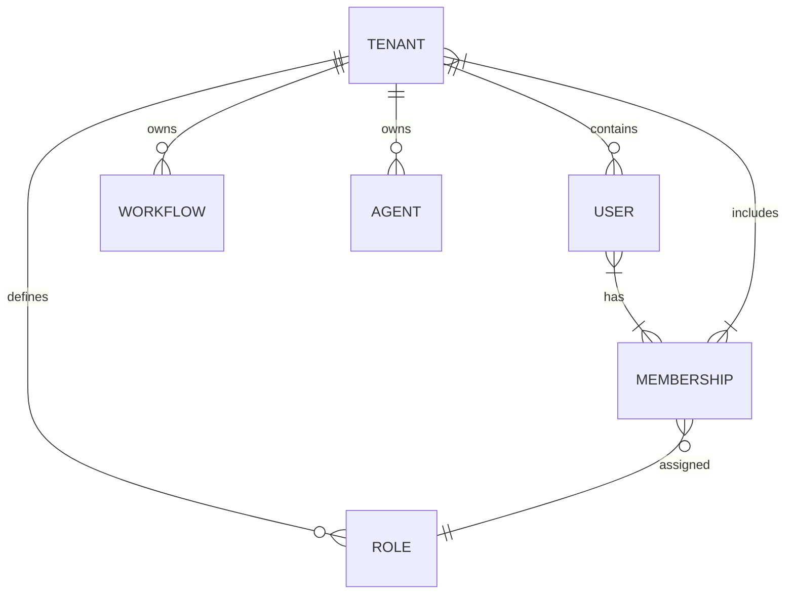
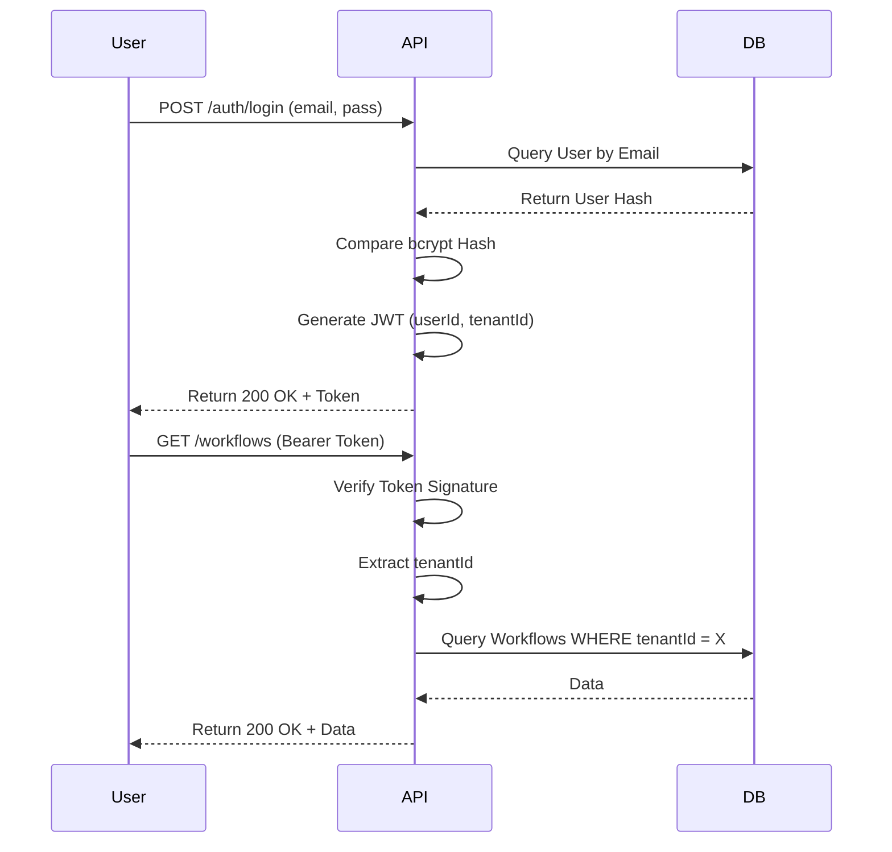
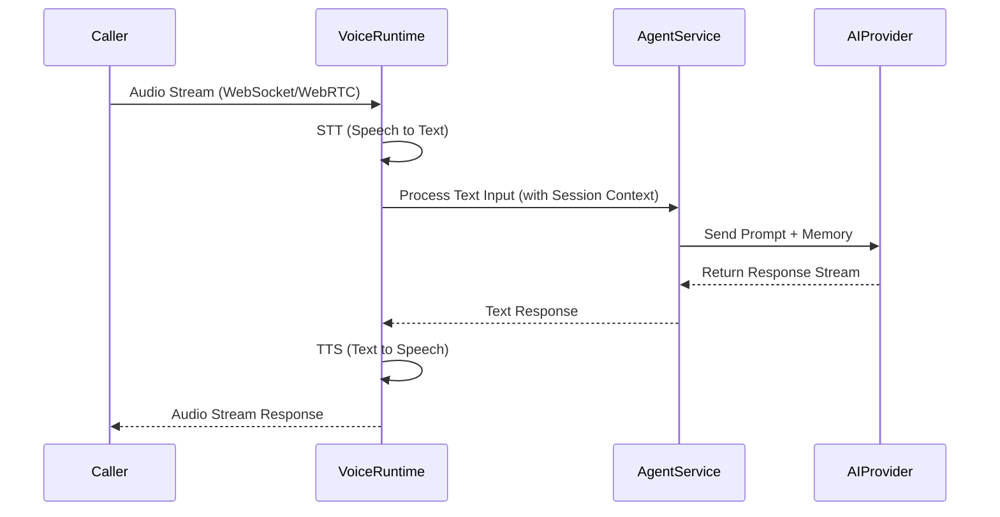

# Platform Diagrams

The following Mermaid diagrams illustrate the core flows and architecture of the Birth Voices Hub.

## High-Level Architecture

## Data Isolation (Multi-Tenancy)

## Authentication Flow

## Voice Runtime Flow

