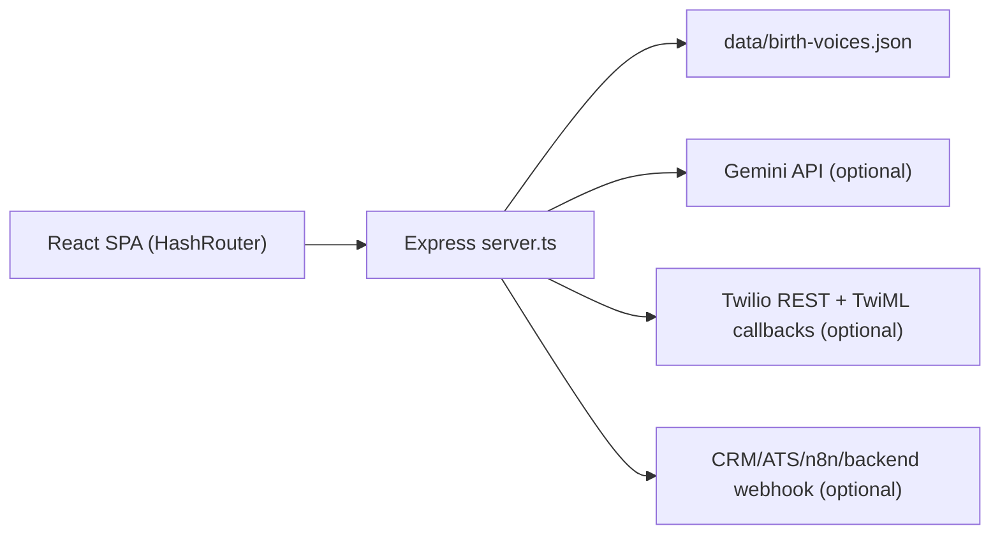

# Mapa de arquitetura

STATUS: PASS

Arquitetura observada:

Camadas:

- Frontend: rotas em `App.tsx`; paginas em `pages/`; componentes em `components/`; cliente HTTP em `lib/api.ts`.
- Backend: `server.ts` contem modelos in-memory tipados, validadores, regras, rotas, integracao Gemini, Twilio, webhook e serving do frontend.
- Persistencia: leitura/escrita atomica simples via temp file + rename em `writeDatabase`, sem locking multi-processo.
- Autenticacao: bearer token salvo no JSON e no `localStorage`.
- Autorizacao/isolamento: escopo por `ownerId` em agents, sessions, integrations, telephonyCalls e deliveries.

Pontos fortes:

- SPA e API rodam no mesmo origin, reduzindo superficie CORS.
- Smoke de producao usa storage temporario isolado.
- Rotas principais de dados filtram por `ownerId`.
- Senhas usam PBKDF2 com salt e comparacao timing-safe.
- Webhook de saida pode assinar payload com HMAC.

Riscos arquiteturais:

- `server.ts` concentra responsabilidades demais: storage, auth, dominio, integracoes, API e static hosting.
- JSON local substitui banco transacional; nao ha migrations, schema versioning, backup ou restore.
- Ausencia de CI, Docker e documentacao operacional limita reprodutibilidade.
- Integracoes externas nao possuem filas, retries com backoff, idempotencia ou timeouts explicitos.
- Twilio callbacks publicos nao validam `X-Twilio-Signature`.
- Admin e organizacao nao tem RBAC real nem modelo de membros/convites.

