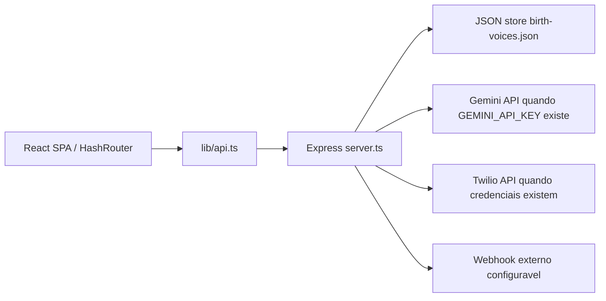

# Mapa de Arquitetura

STATUS: PARTIAL

## Visao

## Camadas observadas

| Camada | Evidencia | Status |
|---|---|---|
| UI | `pages/**`, `components/**` | PASS |
| Cliente API | `lib/api.ts` | PASS |
| Auth browser | `lib/auth.ts`, `localStorage` | PARTIAL |
| Backend/API | `server.ts` endpoints Express | PASS |
| Dominio/servicos | Funcoes no proprio `server.ts` | PARTIAL |
| Persistencia | JSON file por `readDatabase`/`writeDatabase` | PARTIAL |
| Infra/operacao | Sem CI, Docker, IaC | FAIL |

## Dependencias e ciclos

Comando executado:

`npm exec --yes madge -- --circular --extensions ts,tsx --exclude "node_modules|dist" .`

Resultado: `No circular dependency found!` em 25 arquivos processados.

## Riscos arquiteturais

1. `server.ts` e um modulo monolitico de 1297 linhas com regras de auth, persistencia, integracoes, Twilio, Gemini, validacao e rotas.
2. Nao ha repositorios/servicos separados para persistencia, entrega webhook, chamadas Twilio e analise LLM.
3. A persistencia por JSON local e adequada para prototipo/local, mas nao para producao multiusuario sem locks distribuidos, backup, indices e controle transacional.
4. UI e backend usam modelo de isolamento por `ownerId`, mas nao existe conceito formal de tenant/organizacao com RBAC granular.

## Conclusao

Arquitetura pequena e funcional localmente, mas ainda insuficiente para producao real. O principal risco nao e ciclo de dependencia, e sim concentracao de responsabilidades e ausencia de infraestrutura operacional.
